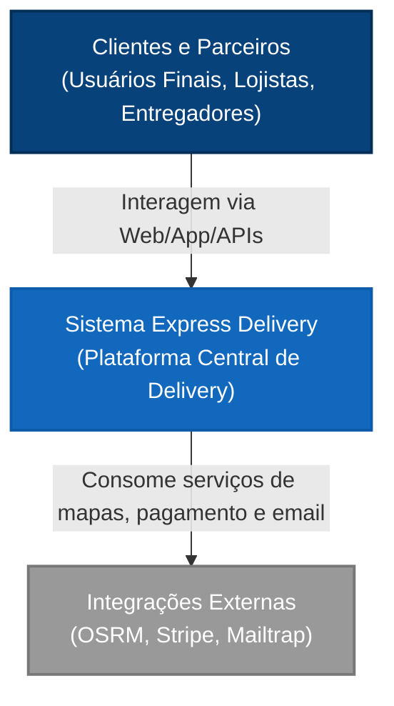
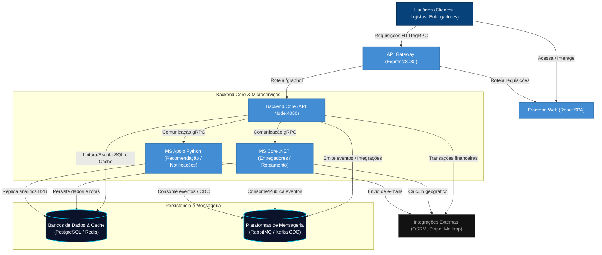
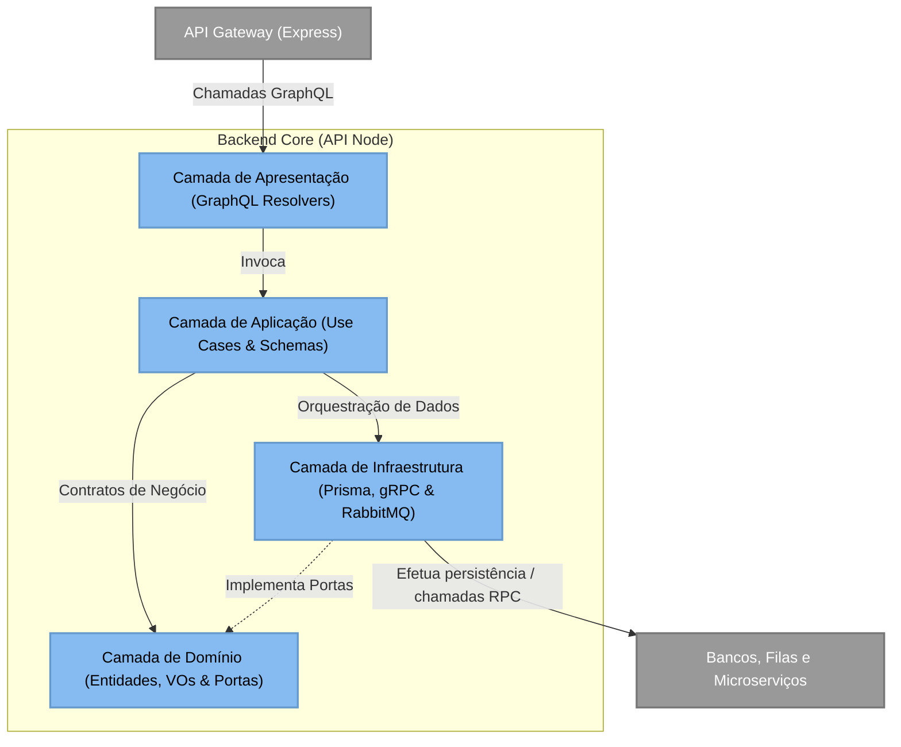

# 📦 Express Delivery - Real-time Microservices Simulation

Este projeto é um ecossistema de alta performance projetado para demonstrar a aplicação prática de arquiteturas modernas e escaláveis. Desenvolvido com foco em **Microserviços**, **Comunicação gRPC** e **Geoprocessamento**, o foco principal reside na implementação de padrões de resiliência e baixa latência em sistemas distribuídos..

---

## 🏛️ Arquitetura do Sistema (Modelo C4)

Utilizamos o Modelo C4 para descrever a estrutura do sistema, dividindo-a em três níveis de detalhamento (Contexto, Contêineres e Componentes) de forma limpa e integrada.

### Nível 1: Contexto do Sistema (System Context)
Apresenta a visão panorâmica de alto nível e como o ecossistema Express Delivery interage com seus diferentes usuários e integrações de terceiros.


> 🔗 [Ver Diagrama de Contexto Detalhado (L1)](docs/diagramas/c1/c4_l1_context.md)

### Nível 2: Contêineres (Containers)
Aumenta o detalhamento expondo a topologia de microsserviços, bancos de dados, cache, brokers de mensagens e telemetria que compõem o ecossistema.


> 🔗 [Ver Diagrama de Contêineres Detalhado (L2)](docs/diagramas/c2/c4_l2_container.md)

### Nível 3: Componentes (Components)
Zoom sobre a organização do container **Backend Core (API Node)**, estruturada sob as premissas da Clean Architecture com injeção e inversão de dependência (DIP).


> 🔗 [Ver Diagrama de Componentes Detalhado (L3)](docs/diagramas/c3/c4_l3_component.md)

---

## 🚀 Como Rodar o Projeto

A aplicação é totalmente conteinerizada com **Docker**. Siga os passos abaixo:

### 1. Pré-requisitos
*   Docker e Docker Compose instalado.
*   Pelo menos 8GB de RAM livre (para o servidor de roteamento OSRM).

### 2. Preparando os Dados de Mapa (OSRM)
1. **Download**: Baixe o mapa do Brasil ou apenas a região Sudeste em [Geofabrik](https://download.geofabrik.de/south-america/brazil.html) (`sudeste-latest.osm.pbf`).
2. **Compilação**: Coloque o arquivo em `./osrm-data/` e execute:
   ```bash
   docker run -t -v "${PWD}/osrm-data:/data" osrm/osrm-backend osrm-extract -p /opt/car.lua /data/seu-arquivo.osm.pbf
   docker run -t -v "${PWD}/osrm-data:/data" osrm/osrm-backend osrm-partition /data/seu-arquivo.osrm
   docker run -t -v "${PWD}/osrm-data:/data" osrm/osrm-backend osrm-customize /data/seu-arquivo.osrm
   ```
3. **Configuração**: Verifique se o nome do arquivo no `compose.yml` (`osrm-server`) condiz com o arquivo gerado (ex: `sudeste-260326.osrm`).

### 3. Execução
```bash
cp .env.example .env
docker compose up --build
```

---

## 🕹️ Manual de Voo: Guia de Simulação

1.  **Acesso**: Acesse `http://localhost:5173`. (O tráfego de API passa pelo API Gateway Express na porta 8080).
2.  **Login**: Registre-se e faça login. Seu endereço servirá de destino para as entregas.
3.  **Radar**: Observe os entregadores se movendo no mapa. Eles atualizam o **Redis** a cada 3 segundos.
4.  **Compra**: Escolha um restaurante e clique em "Comprar".
5.  **Painel Técnico**: No menu lateral, simule as ações do motoboy para ver o rastreamento em tempo real via **gRPC** e **OSRM**.

> [!CAUTION]
> **Persistência de Dados**: O arquivo `compose.yml` está configurado com `--force-reset`. Isso garante que o ambiente de teste sempre inicie em um estado limpo e controlado.

---

## 🛠️ Stack Tecnológica

| Componente | Tecnologia | Papel |
| :--- | :--- | :--- |
| **Frontend** | React, Leaflet | UI moderna e visualização de geoprocessamento |
| **Gateway** | API Gateway (Express) | Porta de entrada profissional, JWT e Rate Limit |
| **API Principal** | Node.js (TypeScript), Apollo Server (GraphQL) | Orquestração de Microserviços e Schema unificado sob Clean Architecture |
| **Microserviços C#** | .NET 10, gRPC, EF Core | Performance extrema para gerenciamento de entregadores e roteamento |
| **Microserviços Python** | Python 3.12, FastAPI, gRPC, Pika | Motores de recomendação de precificação B2B e envio de notificações |
| **Bancos de Dados** | PostgreSQL 15, Redis 7 (Redis Geo) | Persistência física isolada por domínio e cache/localização ultra-rápida |
| **Roteamento** | OSRM Engine (C++ Engine) | Inteligência logística baseada em OpenStreetMap |
| **Mensageria** | RabbitMQ (AMQP) | Barramento de eventos assíncronos (atribuição de entregas) |
| **Change Data Capture (CDC)** | Apache Kafka, Debezium Connect | Replicação de dados transacionais para o motor analítico em tempo real |
| **Observabilidade** | OpenTelemetry, Jaeger, Prometheus, Grafana | Tracing distribuído e métricas consolidadas dos serviços |

---

## 🌟 Funcionalidades e Padrões de Projeto Implementados

Com base nas últimas evoluções de arquitetura descritas no histórico do projeto, as seguintes capacidades estão ativas e funcionais:

*   **Arquitetura baseada em Casos de Uso (Clean Architecture & DIP)**: Divisão estruturada em Presentation (GraphQL Resolvers), Application (Use Cases atômicos e isolados), Domain (Entities, Value Objects & Ports) e Infrastructure, com total inversão de dependências.
*   **Isolamento Completo de Bancos de Dados**: Bancos de dados PostgreSQL dedicados para o núcleo principal (`postgres_db`), entregadores (`postgres_entregadores`) e recomendações B2B (`postgres_recomendacao`), reduzindo drasticamente o acoplamento físico.
*   **Mensageria Assíncrona com RabbitMQ**: Atribuição de entregadores guiada por eventos (`pedido.confirmado` e `entrega.atribuida`) com filas de Dead Letter (DLQ/DLX) para resiliência no processamento.
*   **Change Data Capture (CDC) via Kafka**: Transmissão em tempo real das alterações do banco principal (WAL) para a base analítica, com tratamento resiliente contra desordenação de eventos e tombstones.
*   **Strategy Pattern para Regras de Negócio**: Utilizado para alternar dinamicamente métodos de pagamento (Pix, Cartão de Crédito com limite, Stripe) e níveis de planos de recomendação (Gratuito vs Premium).
*   **Cache Distribuído Híbrido**: Redis operando como cache-aside de queries de alta leitura (como restaurantes e avaliações) e invalidação imediata em mutations para alta performance com consistência imediata.
*   **Monitoramento e Rastreamento Distribuído**: Rastreamento de latência e traces de ponta a ponta correlacionando requisições GraphQL com chamadas gRPC, processamento de filas e banco de dados, exportando para o Jaeger.

---

## 📡 Endpoints de Acesso (Via Gateway)
*   **Aplicação Web (Frontend)**: [http://localhost:5173](http://localhost:5173)
*   **GraphQL Playground (API)**: [http://localhost:8080/graphql](http://localhost:8080/graphql)
*   **OSRM (Direto)**: [http://localhost:5080](http://localhost:5080)
*   **Jaeger Tracing Dashboard**: [http://localhost:16686](http://localhost:16686)
*   **Grafana Dashboards**: [http://localhost:3000](http://localhost:3000)

---

## 🚧 Status e Visão de Futuro (Roadmap)

Este projeto funciona como um **laboratório vivo de arquitetura de software**, mantendo sua base de código alinhada às melhores práticas do mercado.

### Próximas Evoluções Planejadas:
*   **Resiliência Avançada**: Implementação de *Circuit Breakers* (como Polly ou lógica customizada) e políticas de retentativas exponenciais nas chamadas gRPC e conexões do broker.
*   **Testes de Integração E2E**: Ampliação da cobertura de testes automatizados para validar fluxos integrados e simulações completas de ponta a ponta.
*   **Refinamento de Dashboards**: Criação de visualizações avançadas de telemetria no Grafana a partir das métricas e traces coletados pelo Prometheus e Jaeger.

---
*Este projeto demonstra o compromisso com a excelência técnica e a paixão por arquiteturas de software complexas.*
