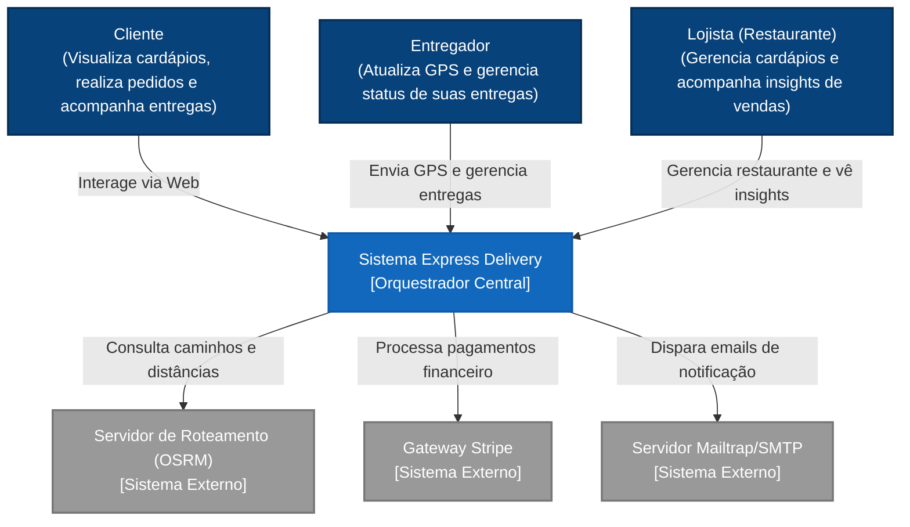

# 📦 Express Delivery - Real-time Microservices Simulation

Este projeto é um ecossistema de alta performance projetado para demonstrar a aplicação prática de arquiteturas modernas e escaláveis. Desenvolvido com foco em **Microserviços**, **Comunicação gRPC** e **Geoprocessamento**, o foco principal reside na implementação de padrões de resiliência e baixa latência em sistemas distribuídos..

---

## 🏛️ Arquitetura do Sistema (Modelo C4)

Utilizamos o Modelo C4 para descrever a estrutura do sistema, dividindo-a em três níveis de detalhamento (Contexto, Contêineres e Componentes) de forma limpa e integrada.

### Nível 1: Contexto do Sistema (System Context)
Apresenta a visão panorâmica de alto nível e como o ecossistema Express Delivery interage com seus diferentes usuários e integrações de terceiros.



### Nível 2: Contêineres (Containers)
Aumenta o detalhamento expondo a topologia de microsserviços, bancos de dados, cache, brokers de mensagens e telemetria que compõem o ecossistema.

```mermaid
graph TB
    %% Styling
    classDef person fill:#08427b,stroke:#052e56,stroke-width:2px,color:#fff;
    classDef container fill:#438dd5,stroke:#3b7bb5,stroke-width:2px,color:#fff;
    classDef db fill:#0b132b,stroke:#00b4d8,stroke-width:2px,color:#fff;
    classDef broker fill:#2d1a12,stroke:#f8961e,stroke-width:2px,color:#fff;
    classDef ext fill:#121212,stroke:#666,stroke-width:1px,color:#aaa;
    classDef obs fill:#333333,stroke:#ff5722,stroke-width:2px,color:#fff;

    %% Actors
    cliente["Cliente (Browser)"]:::person
    entregador["Entregador (App/GPS)"]:::person
    lojista["Lojista (Browser)"]:::person

    %% Entrypoints
    frontend["Frontend Web<br>(React SPA)"]:::container
    gateway["API Gateway (Kong)<br>[Port 8000]"]:::container

    subgraph "Containers de Backend & Bancos (Rede Privada)"
        api_node["Backend Core (API Node)<br>(GraphQL / Prisma)"]:::container
        db_postgres[("PostgreSQL Principal<br>(delivery_db)")]:::db
        db_redis[("Redis Cache & Geo<br>(redis:6379)")]:::db

        ms_entregadores["MS Entregadores<br>(.NET 10 + gRPC)"]:::container
        db_entregadores[("PostgreSQL Entregadores")]:::db

        ms_roteamento["MS Roteamento<br>(.NET 10 + gRPC)"]:::container

        ms_recomendacao["MS Recomendação<br>(FastAPI + gRPC)"]:::container
        db_recomendacao[("PostgreSQL Recomendação")]:::db

        ms_notificacoes["MS Notificações<br>(Python Worker)"]:::container
    end

    subgraph "Barramentos e Integrações Assíncronas"
        rabbitmq["RabbitMQ Message Broker"]:::broker
        kafka_cdc["Kafka + Debezium CDC"]:::broker
    end

    subgraph "Sistemas Externos"
        osrm["OSRM Engine"]:::ext
        stripe["Gateway Stripe"]:::ext
        mailtrap["SMTP Mailtrap"]:::ext
    end

    subgraph "Observabilidade"
        jaeger["Jaeger (Traces)"]:::obs
        prometheus["Prometheus (Metrics)"]:::obs
        grafana["Grafana (Dashboards)"]:::obs
    end

    %% Flows
    cliente -->|Interage| frontend
    lojista -->|Interage| frontend
    frontend -->|HTTP / GraphQL| gateway
    gateway -->|Encaminha /graphql| api_node
    entregador -->|gRPC Coordinate Stream| ms_entregadores

    api_node -->|ORM SQL| db_postgres
    api_node -->|Lê/Escreve Cache| db_redis
    api_node -->|gRPC: Roteamento| ms_roteamento
    api_node -->|gRPC: Recomendações| ms_recomendacao
    api_node -->|gRPC: Buscar Entregador| ms_entregadores
    api_node -->|Processa pagamentos| stripe
    api_node -->|Publica eventos (AMQP)| rabbitmq

    ms_entregadores -->|Persiste dados| db_entregadores
    ms_entregadores -->|Redis Geo commands| db_redis
    ms_entregadores -->|Publica/Consome eventos| rabbitmq

    ms_roteamento -->|Consulta trajetos físicos| osrm

    ms_recomendacao -->|Persiste dados locais| db_recomendacao
    ms_recomendacao -->|Consome eventos| rabbitmq

    ms_notificacoes -->|Consome eventos| rabbitmq
    ms_notificacoes -->|Envia email| mailtrap

    db_postgres -->|CDC logical WAL| kafka_cdc
    kafka_cdc -->|Replica cadastros| ms_recomendacao

    %% Observability flows
    api_node -. "OTLP Traces" .-> jaeger
    ms_entregadores -. "OTLP Traces" .-> jaeger
    ms_roteamento -. "OTLP Traces" .-> jaeger
    ms_recomendacao -. "OTLP Traces" .-> jaeger
    ms_notificacoes -. "OTLP Traces" .-> jaeger

    prometheus -. "Scrape Metrics" .-> api_node
    prometheus -. "Scrape Metrics" .-> ms_recomendacao
    prometheus -. "Scrape Metrics" .-> ms_entregadores
    grafana -->|Painéis| prometheus
    grafana -->|Painéis| jaeger
```

### Nível 3: Componentes (Components)
Zoom sobre a organização do container **Backend Core (API Node)**, estruturada sob as premissas da Clean Architecture com injeção e inversão de dependência (DIP).

```mermaid
graph TB
    %% Styling
    classDef container fill:#438dd5,stroke:#3b7bb5,stroke-width:2px,color:#fff;
    classDef comp fill:#85bbf0,stroke:#6699cc,stroke-width:2px,color:#000;
    classDef port fill:#e9c46a,stroke:#f4a261,stroke-width:2px,color:#000;
    classDef ext fill:#999999,stroke:#777777,stroke-width:2px,color:#fff;

    %% Edge
    gateway["API Gateway (Kong)"]:::container
    db_postgres[("PostgreSQL")]:::ext
    db_redis[("Redis Cache")]:::ext
    rabbitmq["RabbitMQ Broker"]:::ext
    ms_entregadores["MS Entregadores"]:::container
    ms_roteamento["MS Roteamento"]:::container
    ms_recomendacao["MS Recomendação"]:::container

    subgraph api_node ["Backend Core (API Node)"]
        subgraph presentation ["Camada de Apresentação"]
            resolvers["GraphQL Resolvers<br>(Apollo Server)"]:::comp
        end

        subgraph application ["Camada de Aplicação (Use Cases)"]
            validators["Validadores Zod"]:::comp
            
            uc_pedido["ConfirmarPedidoUseCase"]:::comp
            uc_entrega["AtribuirEntregadorUseCase"]:::comp
            uc_assinatura["AssinarPlanoRecomendacaoUseCase"]:::comp
            uc_frota["PovoarFrotaUseCase"]:::comp
            uc_localizacao["AtualizarLocalizacaoEntregadorUseCase"]:::comp
            uc_rota["ObterRotaEstavelUseCase"]:::comp
            uc_insights["ObterInsightsUseCase"]:::comp
            uc_pagamento["ProcessarPagamentoUseCase"]:::comp
            uc_login["LoginUsuarioUseCase"]:::comp
            
            app_services["Serviços de Aplicação<br>(CRUDs auxiliares)"]:::comp
        end

        subgraph domain ["Camada de Domínio (Core)"]
            entities["Entidades de Domínio<br>(Usuario, Pedido, etc.)"]:::comp
            value_objects["Value Objects<br>(Email, Dinheiro, etc.)"]:::comp
            domain_ports["Portas / Interfaces<br>(Contratos de Portas)"]:::port
        end

        subgraph infrastructure ["Camada de Infraestrutura"]
            prisma_adapters["Adaptores Prisma"]:::comp
            grpc_providers["Provedores gRPC"]:::comp
            rabbitmq_pub["RabbitMQPublisher"]:::comp
            rabbitmq_con["RabbitMQConsumer"]:::comp
            redis_client["RedisClient Singleton"]:::comp
            token_service["Serviço de Token (JWT)"]:::comp
            opentelemetry_sdk["OpenTelemetry SDK"]:::comp
        end
    end

    %% Flows
    gateway -->|HTTP GraphQL| resolvers
    resolvers -->|Valida inputs| validators
    
    %% Resolver UCs
    resolvers -->|Invoca| uc_pedido
    resolvers -->|Invoca| uc_assinatura
    resolvers -->|Invoca| uc_frota
    resolvers -->|Invoca| uc_localizacao
    resolvers -->|Invoca| uc_rota
    resolvers -->|Invoca| uc_insights
    resolvers -->|Invoca| uc_login
    resolvers -->|Invoca| app_services

    %% Use Cases -> Domain & Ports
    uc_pedido -->|Usa contratos| domain_ports
    uc_pedido -->|Manipula| entities
    uc_pedido -->|Instancia| value_objects
    
    uc_entrega -->|Usa contratos| domain_ports
    uc_entrega -->|Manipula| entities
    
    uc_frota -->|Usa contratos| domain_ports
    uc_frota -->|Manipula| entities

    rabbitmq_con -->|Consome eventos| rabbitmq
    rabbitmq_con -->|Invoca| uc_entrega

    %% Dependency Inversion (Infra implements Ports)
    prisma_adapters -.->|Implements| domain_ports
    grpc_providers -.->|Implements| domain_ports
    rabbitmq_pub -.->|Implements| domain_ports
    token_service -.->|Implements| domain_ports

    %% Instrumentation
    opentelemetry_sdk -.->|Instrumenta| resolvers
    opentelemetry_sdk -.->|Instrumenta| prisma_adapters
    opentelemetry_sdk -.->|Instrumenta| grpc_providers

    %% Connect to external resources
    prisma_adapters -->|SQL| db_postgres
    rabbitmq_pub -->|AMQP| rabbitmq
    redis_client -->|TCP| db_redis
    grpc_providers -->|gRPC| ms_entregadores
    grpc_providers -->|gRPC| ms_roteamento
    grpc_providers -->|gRPC| ms_recomendacao
```



---

## 🚀 Como Rodar o Projeto

A aplicação é totalmente conteinerizada com **Docker**. Siga os passos abaixo:

### 1. Pré-requisitos
*   Docker e Docker Compose instalado.
*   Pelo menos 8GB de RAM livre (para o servidor de roteamento OSRM).

### 2. Preparando os Dados de Mapa (OSRM)
1. **Download**: Baixe o mapa do Brasil ou apenas a região Sudeste em [Geofabrik](https://download.geofabrik.de/south-america/brazil.html) (`sudeste-latest.osm.pbf`).
2. **Compilação**: Coloque o arquivo em `./osrm-data/` e execute:
   ```bash
   docker run -t -v "${PWD}/osrm-data:/data" osrm/osrm-backend osrm-extract -p /opt/car.lua /data/seu-arquivo.osm.pbf
   docker run -t -v "${PWD}/osrm-data:/data" osrm/osrm-backend osrm-partition /data/seu-arquivo.osrm
   docker run -t -v "${PWD}/osrm-data:/data" osrm/osrm-backend osrm-customize /data/seu-arquivo.osrm
   ```
3. **Configuração**: Verifique se o nome do arquivo no `compose.yml` (`osrm-server`) condiz com o arquivo gerado (ex: `sudeste-260326.osrm`).

### 3. Execução
```bash
cp .env.example .env
docker compose up --build
```

---

## 🕹️ Manual de Voo: Guia de Simulação

1.  **Acesso**: Acesse `http://localhost:8000`. (O tráfego passa pelo Kong Gateway).
2.  **Login**: Registre-se e faça login. Seu endereço servirá de destino para as entregas.
3.  **Radar**: Observe os entregadores se movendo no mapa. Eles atualizam o **Redis** a cada 3 segundos.
4.  **Compra**: Escolha um restaurante e clique em "Comprar".
5.  **Painel Técnico**: No menu lateral, simule as ações do motoboy para ver o rastreamento em tempo real via **gRPC** e **OSRM**.

> [!CAUTION]
> **Persistência de Dados**: O arquivo `compose.yml` está configurado com `--force-reset`. Isso garante que o ambiente de teste sempre inicie em um estado limpo e controlado.

---

## 🛠️ Stack Tecnológica

| Componente | Tecnologia | Papel |
| :--- | :--- | :--- |
| **Frontend** | React, Leaflet | UI moderna e visualização de geoprocessamento |
| **Gateway** | Kong Gateway | Porta de entrada profissional, JWT e Rate Limit |
| **API Principal** | Node.js, GraphQL | Orquestração de Microserviços e Schema unificado |
| **Microserviços** | .NET 10 (C#), gRPC | Performance extrema e lógica de negócio |
| **Dados** | PostgreSQL, Redis | Persistência relacional e cache de localização ultra-rápido |
| **Roteamento** | OSRM Engine | Inteligência logística baseada em OpenStreetMap |

---

## 📡 Endpoints de Acesso (Via Gateway)
*   **Aplicação Web (Frontend)**: [http://localhost:8000](http://localhost:8000)
*   **GraphQL Playground (API)**: [http://localhost:8000/graphql](http://localhost:8000/graphql)
*   **OSRM (Direto)**: [http://localhost:5080](http://localhost:5080)

---

## 🚧 Status e Visão de Futuro (Roadmap)

Este projeto está em desenvolvimento contínuo, servindo como um **laboratório vivo de arquitetura de software**. O objetivo é consolidar tanto conceitos fundamentais quanto as tendências de mercado mais avançadas.

### Próximas Evoluções Planejadas:
*   **Mensageria & Resiliência**: Implementação de comunicação assíncrona com **RabbitMQ** e padrões de tolerância a falhas (Circuit Breaker).
*   **Checkout & Pagamentos**: Integração de um gateway profissional (Stripe) para simulação de fluxos financeiros reais.
*   **Qualidade & Design**: Refatoração profunda aplicando **Domain-Driven Design (DDD)** e princípios **SOLID**.
*   **Escalabilidade**: Expansão da malha com novos microserviços especializados.
*   **Documentação Avançada**: Evolução completa do Modelo C4 até o nível de código.

---
*Este projeto demonstra o compromisso com a excelência técnica e a paixão por arquiteturas de software complexas.*
