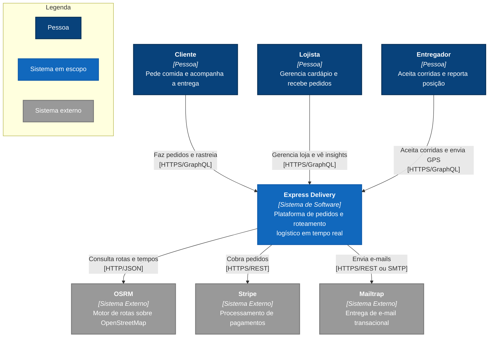

# C4 — Nível 1: Contexto do Sistema

Quem usa o Express Delivery e com quais sistemas de terceiros ele conversa.
O sistema aparece como uma caixa só: nada do que existe dentro dele importa
neste nível.

> **Escopo:** o sistema inteiro · **Público:** qualquer pessoa, técnica ou não

## Fronteira do sistema

O OSRM roda como contêiner próprio no `compose.yml`, mas aparece aqui como
sistema externo por ser um motor de terceiros que o projeto apenas consome — a
decisão de auto-hospedá-lo é de infraestrutura, e aparece no [Nível 2](../c2/c4_l2_container.md).

---
[⬅️ README](../../../README.md) · [Nível 2: Contêineres ➡️](../c2/c4_l2_container.md)
