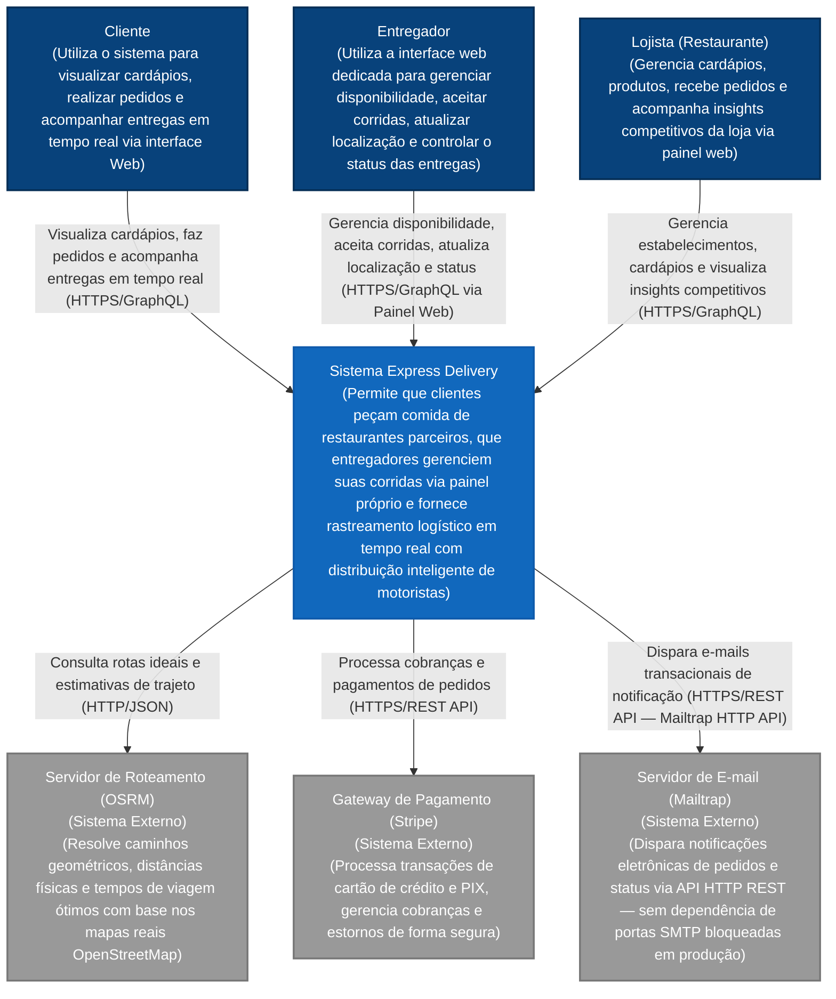

# Nível 1: Diagrama de Contexto de Sistema (System Context Diagram)

Apresenta a visão de alto nível do ecossistema Express Delivery e como ele se integra com usuários e sistemas externos.

---
[⬅️ Voltar para o README](../../../README.md)
