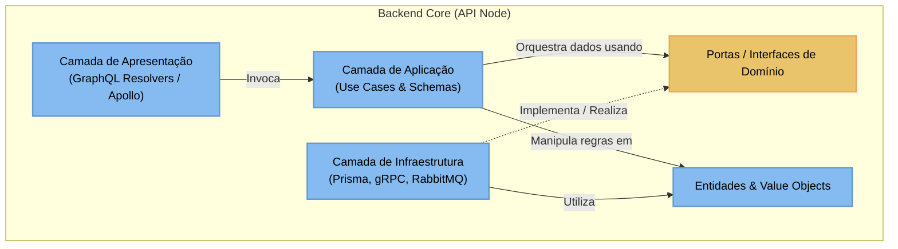
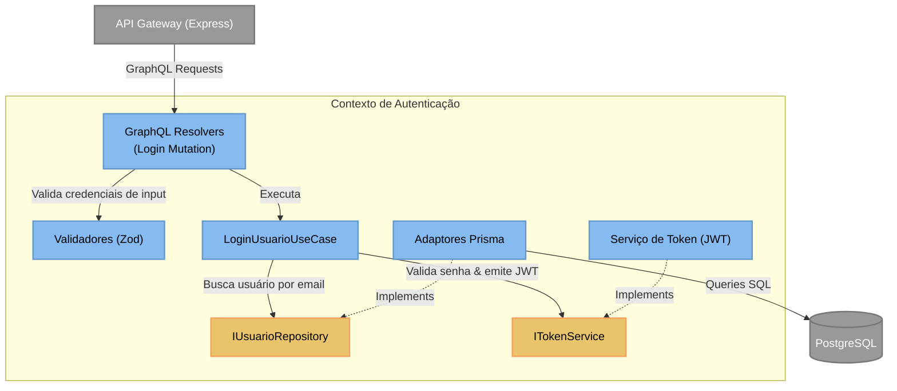
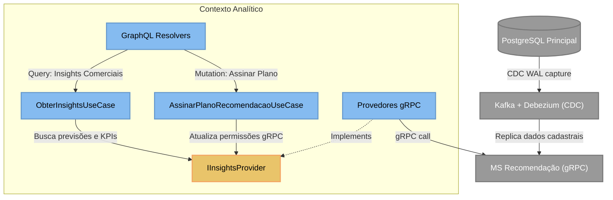
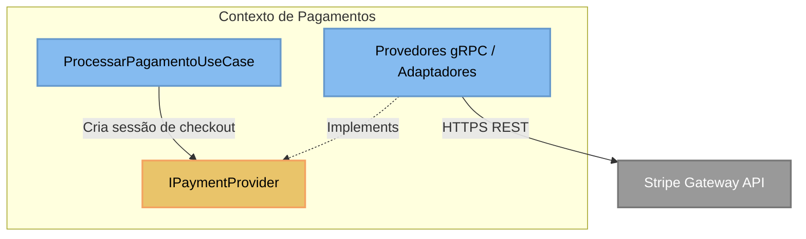

# Nível 3: Diagrama de Componentes (Component Diagram)

Devido à complexidade e diversidade de responsabilidades do **Backend Core (API Node)**, o diagrama de componentes é dividido em 4 contextos de negócio/lógicos fundamentais, além de uma visão geral de camadas (Clean Architecture).

---

## 1. Visão Geral das Camadas (Clean Architecture & DIP)

Demonstra o fluxo geral de controle e a inversão de dependência (DIP) entre as camadas do sistema.

---

## 2. Contexto de Autenticação & Usuários

Focado na identificação, login, geração de tokens seguros (JWT) e persistência de credenciais no banco principal.

---

## 3. Contexto de Pedidos, Entregas & Roteamento (Core Logístico)

O coração logístico da plataforma, englobando a confirmação de pedidos, simulação de frotas, atualização geográfica e o cálculo de rotas físicas.

```mermaid
graph TB
    %% Styling
    classDef comp fill:#85bbf0,stroke:#6699cc,stroke-width:2px,color:#000;
    classDef port fill:#e9c46a,stroke:#f4a261,stroke-width:2px,color:#000;
    classDef ext fill:#999999,stroke:#777777,stroke-width:2px,color:#fff;

    rabbitmq["RabbitMQ Message Broker"]:::ext
    db_redis[("Redis Cache / Geo")]:::ext
    db_postgres[("PostgreSQL")]:::ext
    ms_entregadores["MS Entregadores (gRPC)"]:::ext
    ms_roteamento["MS Roteamento (gRPC)"]:::ext

    subgraph logistic_context ["Contexto de Logística"]
        resolvers["GraphQL Resolvers"]:::comp
        
        %% Use Cases
        uc_pedido["ConfirmarPedidoUseCase"]:::comp
        uc_entrega["AtribuirEntregadorUseCase"]:::comp
        uc_frota["PovoarFrotaUseCase"]:::comp
        uc_localizacao["AtualizarLocalizacaoEntregadorUseCase"]:::comp
        uc_rota["ObterRotaEstavelUseCase"]:::comp
        uc_coleta["ObterRotaColetaUseCase"]:::comp
        uc_entrega_rota["ObterRotaEntregaUseCase"]:::comp

        %% Ports
        i_pedido_repo["IPedidoRepository"]:::port
        i_entregador_provider["IEntregadorProvider"]:::port
        i_rota_provider["IRotaProvider"]:::port
        i_pub["IEventPublisher"]:::port

        %% Infra
        prisma_adapters["Adaptores Prisma"]:::comp
        grpc_providers["Provedores gRPC"]:::comp
        rabbitmq_pub["RabbitMQPublisher"]:::comp
        rabbitmq_con["RabbitMQConsumer"]:::comp
        redis_client["RedisClient"]:::comp
    end

    %% Flows
    resolvers -->|Invoca| uc_pedido
    resolvers -->|Invoca| uc_frota
    resolvers -->|Invoca| uc_localizacao
    resolvers -->|Invoca| uc_rota

    %% UC Pedido
    uc_pedido -->|Persiste pedido| i_pedido_repo
    uc_pedido -->|Dispara pedido.confirmado| i_pub

    %% UC Entrega (Tratado pelo background worker)
    rabbitmq_con -->|Consome entrega.atribuida| rabbitmq
    rabbitmq_con -->|Executa| uc_entrega
    uc_entrega -->|Persiste status de entrega| i_pedido_repo

    %% UC Localização
    uc_localizacao -->|Salva posições geográficas| redis_client

    %% UC Rotas & Frota
    uc_frota -->|Popula frotas| i_entregador_provider
    uc_rota -->|Calcula trajetos| i_rota_provider
    uc_coleta -->|Calcula trajetos| i_rota_provider
    uc_entrega_rota -->|Calcula trajetos| i_rota_provider

    %% Interface implementations
    prisma_adapters -.->|Implements| i_pedido_repo
    grpc_providers -.->|Implements| i_entregador_provider
    grpc_providers -.->|Implements| i_rota_provider
    rabbitmq_pub -.->|Implements| i_pub

    %% External calls
    prisma_adapters -->|SQL| db_postgres
    rabbitmq_pub -->|AMQP Publish| rabbitmq
    redis_client -->|TCP Geo Commands| db_redis
    grpc_providers -->|"gRPC: Buscar Entregadores"| ms_entregadores
    grpc_providers -->|"gRPC: Traçar Rotas"| ms_roteamento
```

---

## 4. Contexto de Assinaturas, Recomendações & Insights

Responsável por planos de insights, consumo de relatórios analíticos de vendas e replicação de dados CDC (Change Data Capture) via Kafka.

---

## 5. Contexto de Pagamento

Gerenciamento de fluxos financeiros, chamadas ao gateway externo (Stripe) e atualização de status de transações.

---
[⬅️ Voltar para o README](../../../README.md)
