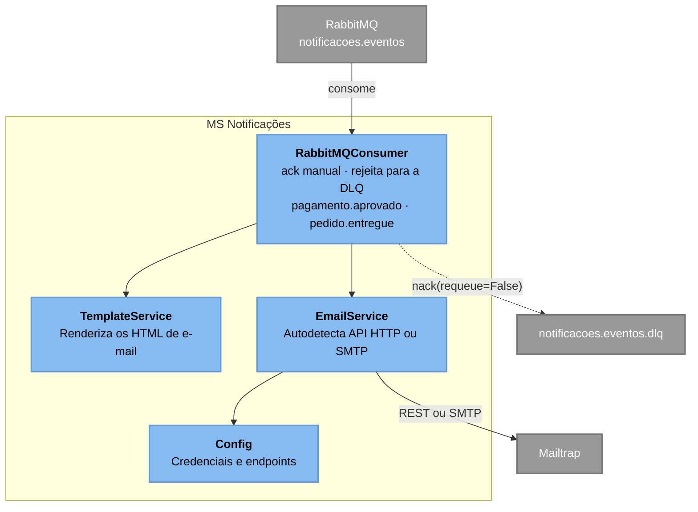

# C3 — MS Notificações

> **Contêiner aberto:** MS Notificações · **Stack:** Python 3.12 · pika · urllib

O serviço mais simples do sistema: consome eventos e manda e-mail. Não tem banco,
não expõe API e não guarda estado.

## Observações de projeto

**O `EmailService` escolhe o transporte em tempo de execução.** Se existir token
da API do Mailtrap, envia por HTTP REST; senão, cai para SMTP. A razão é de
infraestrutura: PaaS costuma bloquear as portas de saída de SMTP, e o mesmo
binário precisa funcionar no compose local e na nuvem.

**A falha é retida, não descartada.** O consumidor usa `ack` manual e rejeita com
`requeue=False`, o que envia a mensagem para `notificacoes.eventos.dlq` em vez de
destruí-la. Um e-mail que falhou fica disponível para inspeção.

**Não há verificação de duplicata.** Se a mesma mensagem for reentregue, o e-mail
é enviado de novo. É a dívida de idempotência descrita nos trade-offs do
[README](../../../README.md) — aceitável aqui porque o custo de um e-mail
duplicado é baixo.

---
[⬅️ Índice do Nível 3](README.md) · [Nível 2: Contêineres](../c2/c4_l2_container.md)
