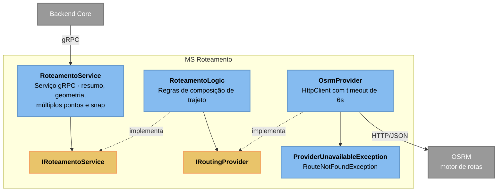

# C3 — MS Roteamento

> **Contêiner aberto:** MS Roteamento · **Stack:** .NET 10 · gRPC · HttpClient

Converte coordenadas em distância, tempo e geometria de trajeto. Não tem banco:
todo o estado vem do OSRM a cada chamada.

## Observações de projeto

`IRoutingProvider` isola o motor de rotas: trocar OSRM por Google Directions ou
Valhalla seria escrever outro adaptador, sem tocar em `RoteamentoLogic`.

O `HttpClient` tem timeout explícito de 6 segundos, abaixo do deadline de 8s que o
Backend Core aplica na chamada gRPC. A ordem importa: o timeout mais curto tem que
estar mais fundo na pilha, senão quem chama desiste antes e o trabalho continua
rodando aqui sem ninguém para receber a resposta.

`SnapToRoadAsync` é o único ponto que engole a falha e devolve a coordenada
original — ajustar um ponto à via mais próxima é melhoria, não requisito, e não
deve derrubar o cálculo inteiro.

---
[⬅️ Índice do Nível 3](README.md) · [Nível 2: Contêineres](../c2/c4_l2_container.md)
